# Flask Student Registration System — CI/CD Pipeline

A fully automated CI/CD pipeline using **GitHub Actions** that tests, builds, containerizes, and deploys a Python Flask + MongoDB application to AWS EC2, with email notifications on success or failure.

## Architecture

```
Developer Push → GitHub Actions Trigger
    │
    ├── 1. Checkout code
    ├── 2. Install dependencies (pip install)
    ├── 3. Run pytest (stops pipeline if tests fail)
    ├── 4. Build Docker image (tagged with commit SHA)
    ├── 5. Push image to Amazon ECR
    ├── 6. Deploy to EC2 via SSH (stop old → run new container)
    ├── 7. Verify /health endpoint (5 retries)
    └── 8. Send email notification (success or failure)
```

## Tech Stack

| Component          | Technology               |
|--------------------|--------------------------|
| Application        | Python Flask              |
| Database           | MongoDB Atlas             |
| Containerization   | Docker                    |
| Container Registry | Amazon ECR                |
| Compute Target     | AWS EC2 (Ubuntu)          |
| CI/CD Tool         | GitHub Actions            |
| Notifications      | Gmail SMTP                |

---

## Phase 1 — Local Setup

### Step 1 — Fork & Clone the Repository

Fork and clone the [flask_Practice](https://github.com/mohanDevOps-arch/flask_Practice) repo.

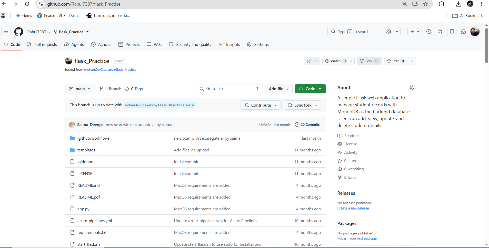

Verify the clone with `git remote -v` and `ls`:

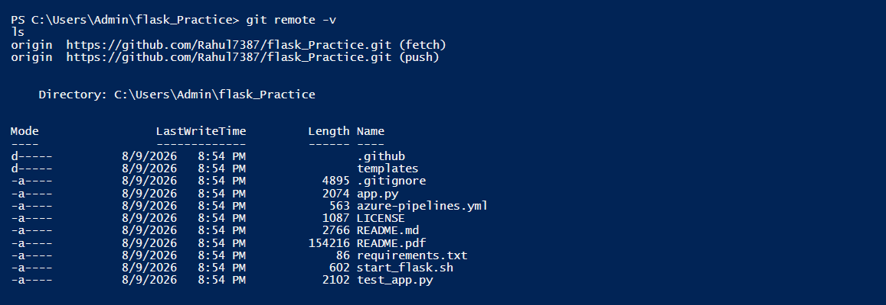

### Step 2 — Review Existing Code

Examine the existing `app.py` to understand the application structure:


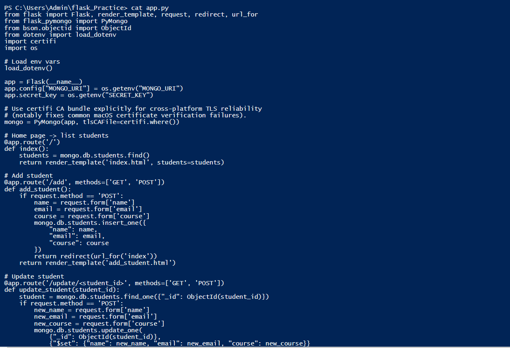

Review `test_app.py` and `requirements.txt`:

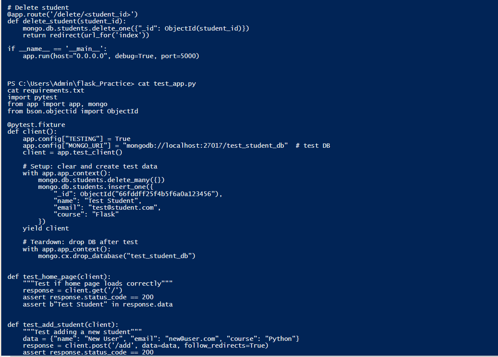

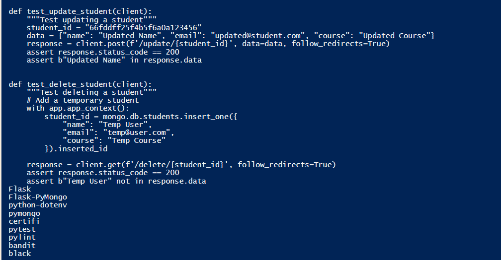

### Step 3 — Add the /health Route

Add the health check endpoint to `app.py` just before the `if __name__ == '__main__':` line:

```python
@app.route('/health')
def health():
    try:
        mongo.db.command('ping')
        return {"status": "healthy", "database": "connected"}, 200
    except Exception as e:
        return {"status": "unhealthy", "error": str(e)}, 500
```

### Step 4 — Create the Dockerfile

Create a `Dockerfile` in the project root:

```dockerfile
FROM python:3.11-slim
WORKDIR /app
COPY requirements.txt .
RUN pip install --no-cache-dir -r requirements.txt
COPY . .
EXPOSE 5000
CMD ["python", "app.py"]
```

Also create a `.dockerignore` to keep the image clean:

```
__pycache__
*.pyc
.env
.git
.github
*.pem
*.pdf
venv
.pytest_cache
```

**Issue encountered:** Windows Notepad saved the file as `Dockerfile.txt` instead of `Dockerfile`, causing a "file not found" error:

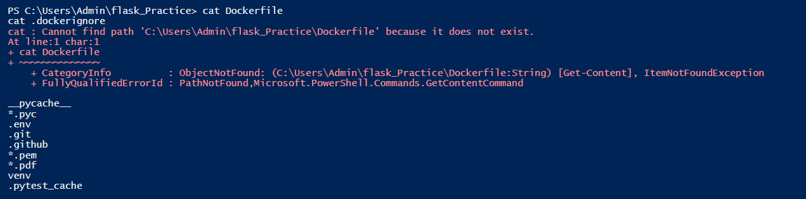

**Fix:** Rename the file:

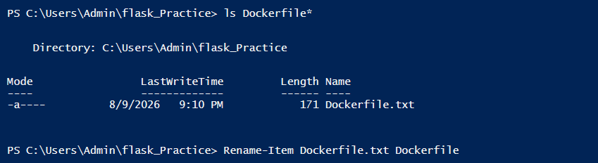

### Step 5 — Create .env.example

Create a template showing required environment variables (without actual values):

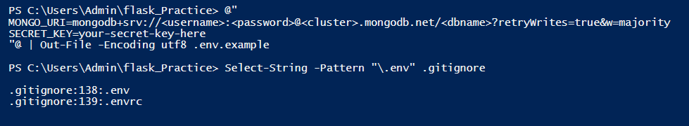

Verify the file contents:

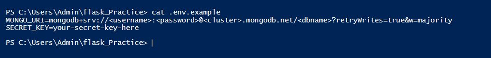

### Step 6 — Update test_app.py

Add a test for the `/health` route at the bottom of `test_app.py`:

```python
def test_health_check(client):
    """Test if health endpoint responds"""
    response = client.get('/health')
    assert response.status_code in [200, 500]
```

---

## Phase 2 — AWS Setup

### Step 7 — Create an ECR Repository

Navigate to AWS Console → Elastic Container Registry:

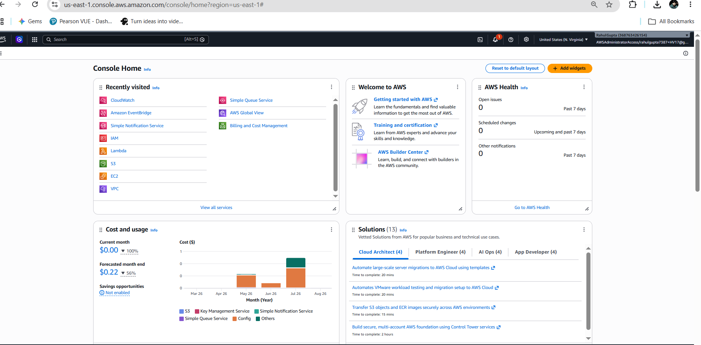

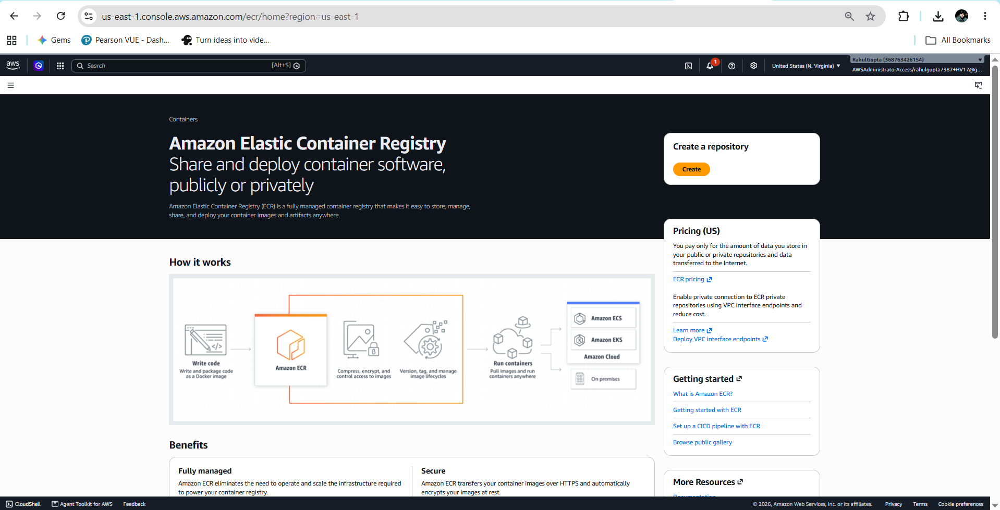

Create a private repository named `flask-practice`:

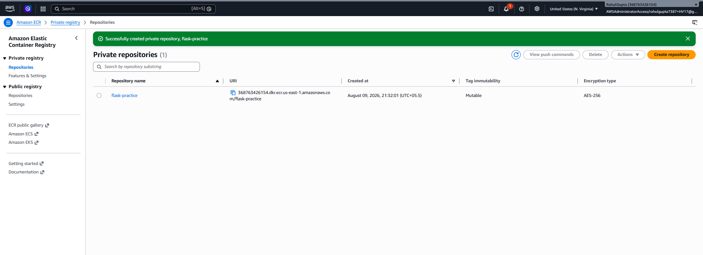

Repository URI: `368763426154.dkr.ecr.us-east-1.amazonaws.com/flask-practice`

### Step 8 — Launch an EC2 Instance

Navigate to AWS Console → EC2 → Launch instance:

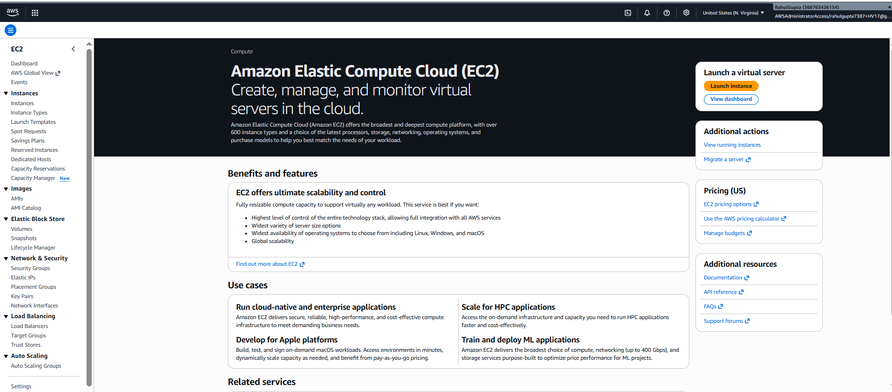

Settings:
- **Name:** `flask-cicd-server`
- **AMI:** Ubuntu 24.04 LTS
- **Instance type:** `t2.micro` (free tier)
- **Key pair:** `flask-cicd-key` (download `.pem` file)

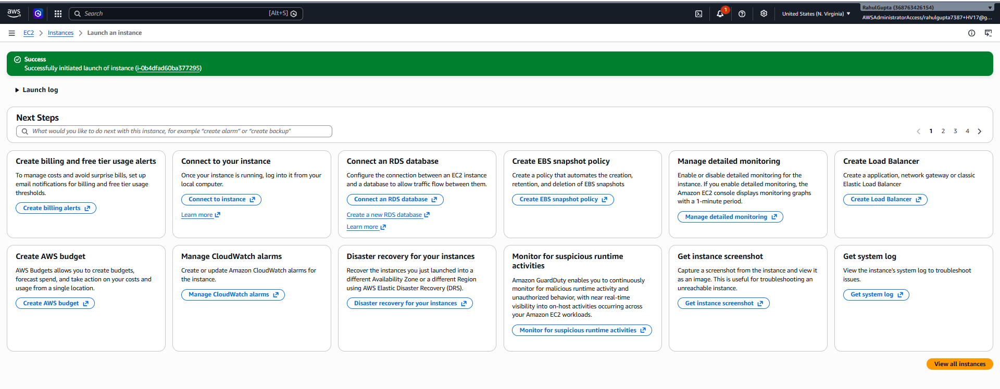

### Step 9 — Attach IAM Role to EC2

Create an IAM role for EC2 to pull images from ECR:
- **Trusted entity:** AWS service → EC2
- **Policy:** `AmazonEC2ContainerRegistryReadOnly`
- **Role name:** `EC2-ECR-Pull-Role`

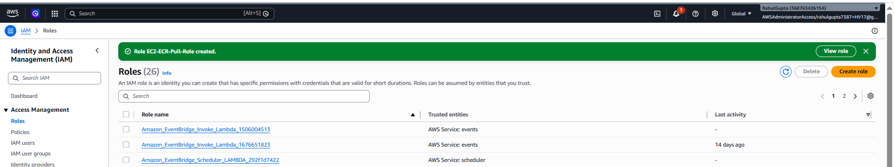

Go to EC2 → select the instance → Actions → Security → Modify IAM role:

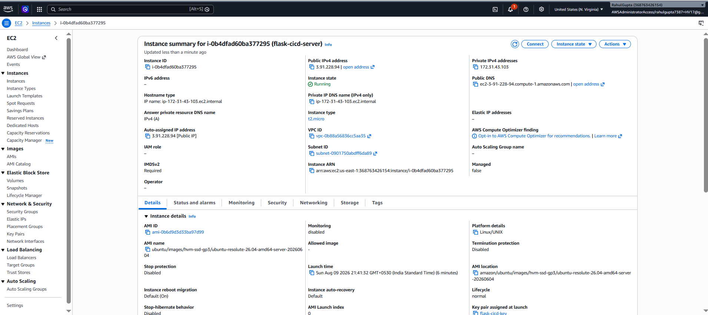

Select `EC2-ECR-Pull-Role` and click Update IAM role:

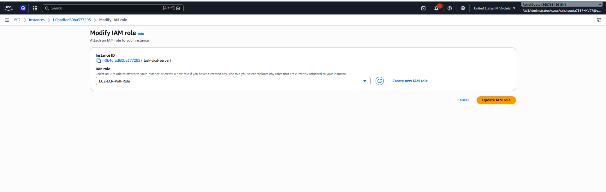

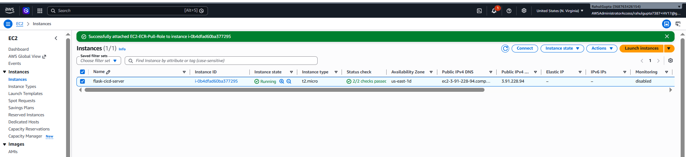

### Step 10 — Configure Security Group

Add inbound rules for SSH and Flask app access:

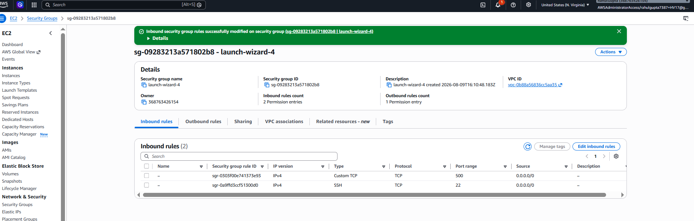

| Type       | Port | Source    | Purpose                        |
|------------|------|-----------|--------------------------------|
| SSH        | 22   | 0.0.0.0/0| Pipeline SSH deployment access |
| Custom TCP | 5000 | 0.0.0.0/0| Flask app and health checks    |

### Step 11 — Install Docker & AWS CLI on EC2

SSH into the instance and install prerequisites:

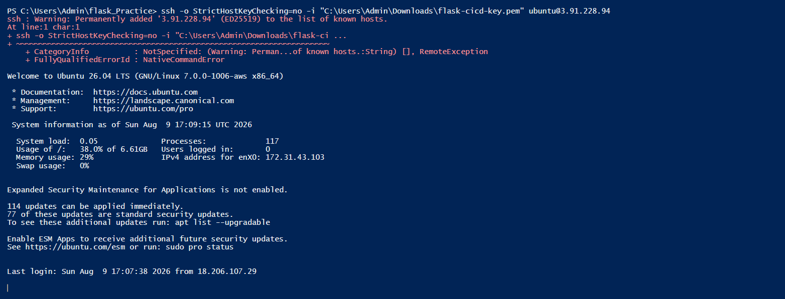

Install Docker and AWS CLI, then verify:

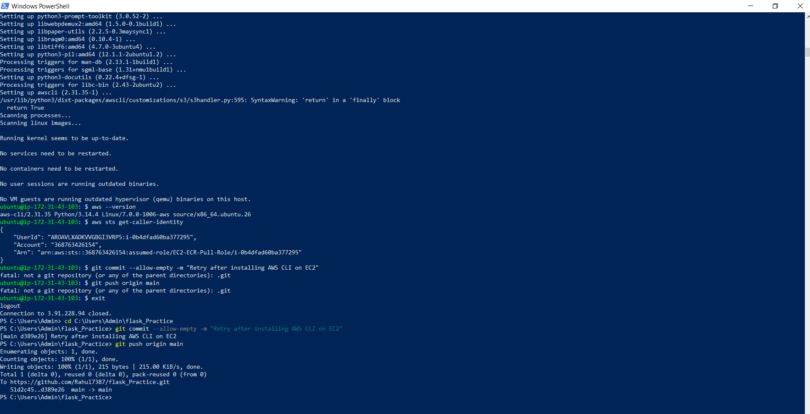

```bash
sudo apt update && sudo apt install -y docker.io awscli
sudo systemctl enable docker && sudo systemctl start docker
sudo usermod -aG docker ubuntu
```

---

## Phase 3 — GitHub Actions Pipeline

### Step 12 — Configure Repository Secrets

Go to GitHub repo → **Settings** → **Secrets and variables** → **Actions** → **New repository secret**:

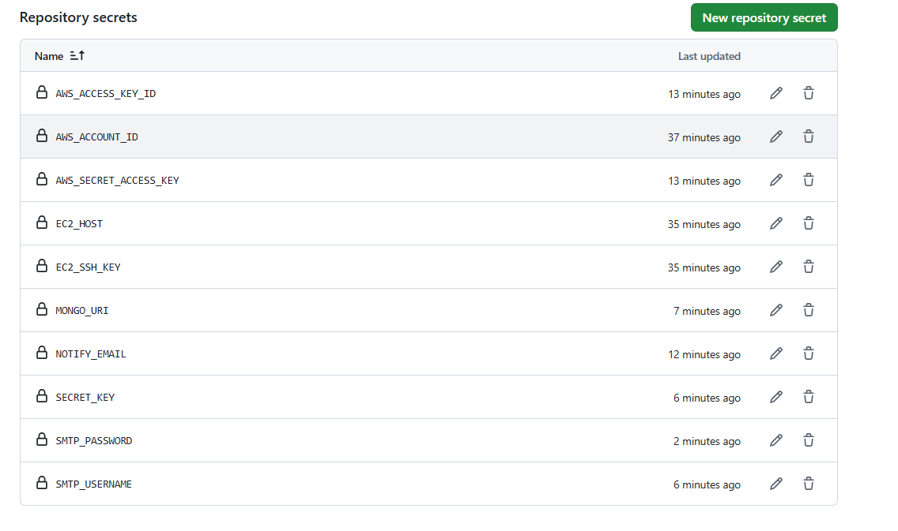

| Secret Name            | Description                                      |
|------------------------|--------------------------------------------------|
| `AWS_ACCOUNT_ID`       | 12-digit AWS account number (no dashes)          |
| `AWS_ACCESS_KEY_ID`    | IAM user access key                              |
| `AWS_SECRET_ACCESS_KEY`| IAM user secret key                              |
| `EC2_HOST`             | EC2 instance public IPv4 address                 |
| `EC2_SSH_KEY`          | Full content of the `.pem` private key file      |
| `MONGO_URI`            | MongoDB Atlas connection string                  |
| `SECRET_KEY`           | Any random string for Flask sessions             |
| `SMTP_USERNAME`        | Gmail address used to send notifications         |
| `SMTP_PASSWORD`        | Gmail App Password (16 characters, no spaces)    |
| `NOTIFY_EMAIL`         | Email address to receive pipeline notifications  |

### Step 13 — Commit and Push

Review changes with `git status`:

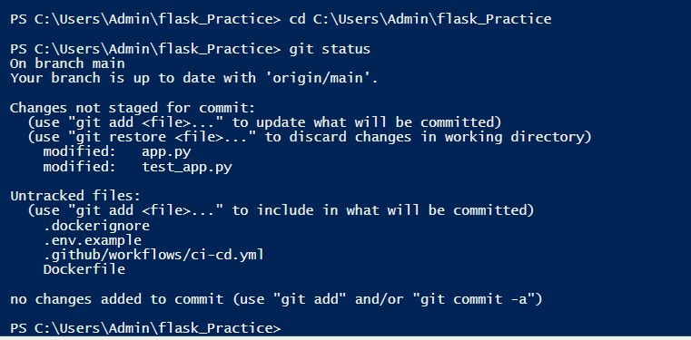

Stage, commit, and push:

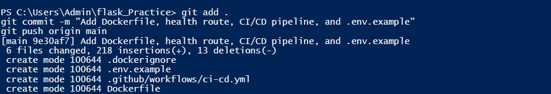

---

## Phase 4 — Pipeline Results

### GitHub Actions Workflow Runs

After pushing, the pipeline triggers automatically. The Actions tab shows all workflow runs including the troubleshooting iterations:

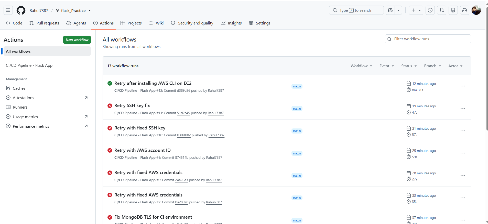

### Health Check Verification

The deployed application responds with a healthy status at the `/health` endpoint:

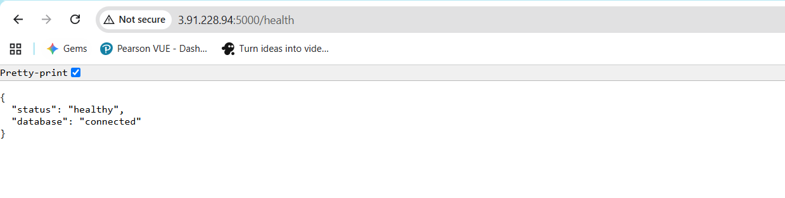

### Email Notifications

**Failure notification** (custom SMTP via Gmail):

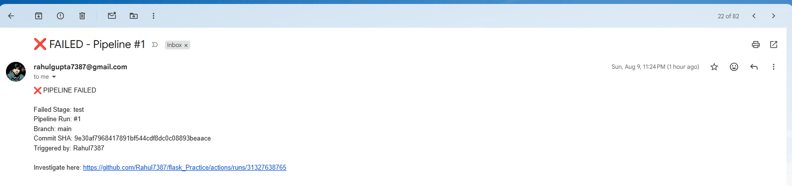

**GitHub notification** for failed workflow run:

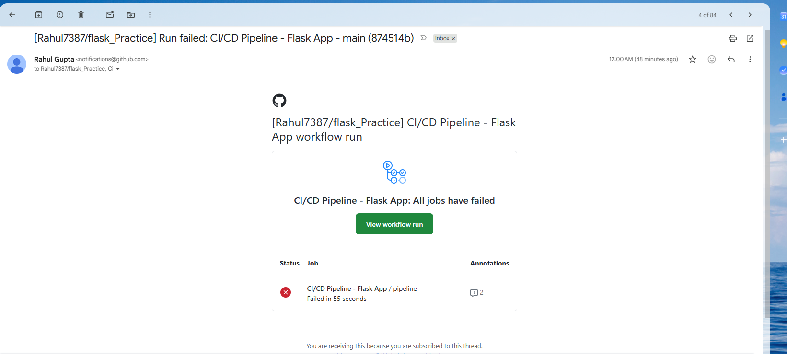

**Success notification** after all stages pass:

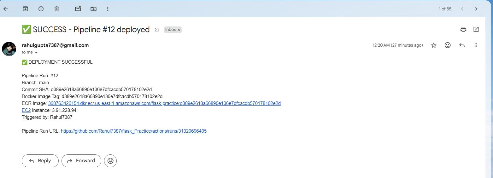

---

## Errors Encountered & Fixes

| # | Error | Root Cause | Fix |
|---|-------|-----------|-----|
| 1 | Old workflow running instead of ours | Forked repo had a `securegate-security-check` workflow | Deleted `securegate*.yml` and `securegate-summary.yaml` from `.github/workflows/` |
| 2 | Tests failing — MongoDB SSL/TLS issue | `app.py` forced TLS (`tlsCAFile=certifi.where()`) on every connection, but CI MongoDB has no SSL | Made TLS conditional — only use it for `mongodb+srv` (Atlas) connections |
| 3 | Tests failing — no MongoDB in CI | Tests needed a running MongoDB instance | Added `services` block with `mongo:7` on port 27017 + env vars in test step |
| 4 | AWS credential signature mismatch | `AWS_ACCESS_KEY_ID` or `AWS_SECRET_ACCESS_KEY` copy-pasted incorrectly | Deleted old keys, generated new ones in IAM, re-added as GitHub secrets |
| 5 | Docker build — invalid image tag | `AWS_ACCOUNT_ID` secret was missing | Added 12-digit account number as GitHub secret |
| 6 | SSH key not found | `EC2_SSH_KEY` secret had encoding/formatting issues | Used `Get-Content flask-cicd-key.pem -Raw` for clean key, re-created secret |
| 7 | `aws: command not found` on EC2 | AWS CLI not installed on the EC2 instance | SSHed in and ran `sudo apt install -y awscli` |
| 8 | Health check getting 000 response | Security group only had port 22 open | Added Custom TCP rule for port 5000 with source `0.0.0.0/0` |

---

## Deployment Method: SSH

We chose **SSH-based deployment** over AWS SSM for the following reasons:

- **Simpler setup**: Only requires a key pair stored in GitHub Secrets — no SSM Agent configuration, no additional IAM policies for SSM.
- **Direct control**: The pipeline SSHes into EC2 and runs docker commands directly, making the deployment steps transparent and easy to debug.
- **Widely understood**: SSH is a fundamental DevOps skill and makes the pipeline readable for anyone.

### What the deploy step does:

```bash
# 1. Authenticate Docker with ECR using the EC2 instance's IAM role
aws ecr get-login-password --region us-east-1 | docker login --username AWS --password-stdin <ECR_URI>

# 2. Pull the new image (tagged with commit SHA)
docker pull <ECR_URI>/flask-practice:<COMMIT_SHA>

# 3. Stop and remove the old container (|| true prevents failure on first deploy)
docker stop flask-app || true
docker rm flask-app || true

# 4. Run the new container with --restart unless-stopped (survives reboots)
docker run -d \
  --name flask-app \
  --restart unless-stopped \
  -p 5000:5000 \
  -e MONGO_URI='<from_secrets>' \
  -e SECRET_KEY='<from_secrets>' \
  <ECR_URI>/flask-practice:<COMMIT_SHA>
```

## Pipeline Stages Explained

### 1. Checkout
Uses `actions/checkout@v4` to pull the latest source code from the `main` branch.

### 2. Install Dependencies
Sets up Python 3.11 and runs `pip install -r requirements.txt`.

### 3. Test
Runs `pytest test_app.py` against a MongoDB service container (`mongo:7` on port 27017). If any test fails, the pipeline stops — broken code never reaches EC2. The `FAILED_STAGE` environment variable is set to `test` so the failure email reports the correct stage.

### 4. Build
Builds the Docker image and tags it with the full Git commit SHA (`${{ github.sha }}`), not just `latest`. This ensures every deployed image is traceable to a specific commit.

### 5. Push to ECR
Authenticates to ECR using `aws-actions/configure-aws-credentials@v4` and `aws-actions/amazon-ecr-login@v2`, then pushes the tagged image.

### 6. Deploy to EC2
Uses `appleboy/ssh-action@v1` to SSH into the EC2 instance and run the deployment commands (pull, stop old, run new).

### 7. Verify (Health Check)
Polls `http://<EC2_HOST>:5000/health` up to 5 times with 5-second intervals. Only an HTTP 200 counts as success. This is the real deployment gate — a container that starts but crashes returns 000 or 500 and the pipeline reports failure.

### 8. Notify
Sends an email via Gmail SMTP using `dawidd6/action-send-mail@v3`:
- **On success**: Includes commit SHA, branch, image tag, ECR URI, EC2 target, and pipeline run link.
- **On failure**: Includes which specific stage failed (test/build/push/deploy), commit SHA, branch, and a direct link to the logs.

## Health Check Endpoint

Added to `app.py` — pings MongoDB to verify the application and database are both operational:

```python
@app.route('/health')
def health():
    try:
        mongo.db.command('ping')
        return {"status": "healthy", "database": "connected"}, 200
    except Exception as e:
        return {"status": "unhealthy", "error": str(e)}, 500
```

## Prerequisites

### AWS Resources (set up manually before the pipeline runs)

1. **ECR Repository**
   - Name: `flask-practice`
   - Visibility: Private
   - Region: `us-east-1`

2. **EC2 Instance**
   - AMI: Ubuntu 24.04+ LTS
   - Instance type: `t2.micro` (free tier eligible)
   - Key pair: Create and download `.pem` file
   - Docker installed: `sudo apt install -y docker.io`
   - AWS CLI installed: `sudo apt install -y awscli`
   - Docker service running: `sudo systemctl enable docker && sudo systemctl start docker`
   - Ubuntu user in docker group: `sudo usermod -aG docker ubuntu`

3. **IAM Role for EC2**
   - Role name: `EC2-ECR-Pull-Role`
   - Policy: `AmazonEC2ContainerRegistryReadOnly`
   - Attached to the EC2 instance via Actions → Security → Modify IAM Role

4. **IAM User for GitHub Actions**
   - User name: `github-cicd-user`
   - Policies: `AmazonEC2ContainerRegistryFullAccess`, `AmazonEC2FullAccess`
   - Access keys generated for programmatic access

5. **MongoDB Atlas**
   - Free M0 cluster
   - Database user created
   - Network access: Allow from Anywhere (`0.0.0.0/0`)

6. **Gmail App Password**
   - 2-Step Verification enabled on Google account
   - App Password generated at myaccount.google.com/apppasswords

## Manual Deployment (if pipeline unavailable)

If the GitHub Actions pipeline is down, you can deploy manually:

```bash
# 1. Build the image locally
docker build -t flask-practice:manual .

# 2. Tag for ECR
docker tag flask-practice:manual <AWS_ACCOUNT_ID>.dkr.ecr.us-east-1.amazonaws.com/flask-practice:manual

# 3. Authenticate to ECR
aws ecr get-login-password --region us-east-1 | docker login --username AWS --password-stdin <AWS_ACCOUNT_ID>.dkr.ecr.us-east-1.amazonaws.com

# 4. Push to ECR
docker push <AWS_ACCOUNT_ID>.dkr.ecr.us-east-1.amazonaws.com/flask-practice:manual

# 5. SSH into EC2
ssh -i "flask-cicd-key.pem" ubuntu@<EC2_PUBLIC_IP>

# 6. On EC2: pull and run
aws ecr get-login-password --region us-east-1 | docker login --username AWS --password-stdin <AWS_ACCOUNT_ID>.dkr.ecr.us-east-1.amazonaws.com
docker pull <AWS_ACCOUNT_ID>.dkr.ecr.us-east-1.amazonaws.com/flask-practice:manual
docker stop flask-app || true
docker rm flask-app || true
docker run -d --name flask-app --restart unless-stopped -p 5000:5000 \
  -e MONGO_URI='<your_mongo_uri>' \
  -e SECRET_KEY='<your_secret_key>' \
  <AWS_ACCOUNT_ID>.dkr.ecr.us-east-1.amazonaws.com/flask-practice:manual

# 7. Verify
curl http://localhost:5000/health
```

## Files Added/Modified

| File | Action | Purpose |
|------|--------|---------|
| `app.py` | Modified | Added `/health` route, made TLS conditional |
| `test_app.py` | Modified | Added `test_health_check` test |
| `Dockerfile` | Created | Builds runnable image of the app |
| `.dockerignore` | Created | Excludes secrets and unnecessary files from image |
| `.github/workflows/ci-cd.yml` | Created | Full CI/CD pipeline definition |
| `.env.example` | Created | Template for required environment variables |
| `README.md` | Updated | This documentation |

## Repository

**GitHub**: [github.com/Rahul7387/flask_Practice](https://github.com/Rahul7387/flask_Practice)

**Forked from**: [github.com/mohanDevOps-arch/flask_Practice](https://github.com/mohanDevOps-arch/flask_Practice)

